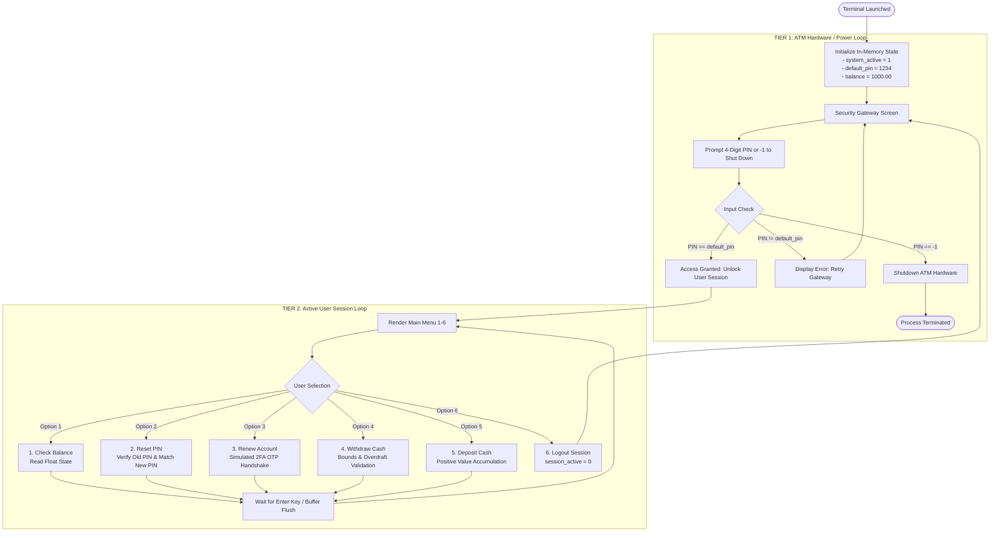

# 🏧 CLI ATM Machine Simulator in C

[](https://en.cppreference.com/w/c)
[](LICENSE)
[-blue)]()
[]()
[]()

> A robust, modular Command Line Interface (CLI) ATM simulator written in standard C. Engineered with a **2-Tier Nested State Architecture**, dynamic in-memory credential mutation, simulated 2FA verification, and defensive input sanitization.

---

## 📖 Table of Contents

- [🌟 Project Genesis & Background](#-project-genesis--background)
- [🏛️ System Architecture](#️-system-architecture)
  - [Architectural Flowchart](#architectural-flowchart)
  - [2-Tier Loop Model](#2-tier-loop-model)
- [✨ Core Features](#-core-features)
- [🧠 Technical Deep-Dive & Systems Concepts](#-technical-deep-dive--systems-concepts)
- [📁 Project Structure](#-project-structure)
- [🚀 Quick Start & Compilation](#-quick-start--compilation)
  - [Prerequisites](#prerequisites)
  - [Build Commands](#build-commands)
  - [Running the Application](#running-the-application)
- [💻 Interactive Usage Walkthrough](#-interactive-usage-walkthrough)
- [🗺️ Milestones & Development Roadmap](#️-milestones--development-roadmap)
  - [Completed Milestones (Phase 1)](#-completed-milestones-phase-1---core-engine)
  - [Upcoming Milestones (Phase 2 & 3)](#-upcoming-milestones-phase-2--3---scalability--security)
- [💡 Key Takeaways](#-key-takeaways)
- [📜 License & Author](#-license--author)

---

## 🌟 Project Genesis & Background

This project is the capstone verification of an intensive **28-day C programming sprint** undertaken from scratch. The goal of this sprint was to demystify low-level systems programming, understand memory boundaries, master execution loops, and build an unshakable foundation in algorithmic thinking before transitioning into advanced backend and distributed architectures.

After completing the core fundamentals (control flow, data types, standard I/O buffer mechanics, and state variables), this ATM Machine Simulator was conceptualized and built to answer one critical engineering question:

> *"Can I take fundamental C constructs and build a realistic, fault-tolerant, stateful banking machine from scratch without external libraries?"*

The result is a self-contained, memory-safe CLI banking application that accurately simulates physical ATM lifecycle mechanics.

---

## 🏛️ System Architecture

### Architectural Flowchart



### 2-Tier Loop Model

Traditional novice programs terminate upon logout or reset all variables back to initial conditions. This simulator implements a **Nested 2-Tier Architecture**:

```text
+-------------------------------------------------------------------------+
| TIER 1: HARDWARE RUNTIME LOOP (system_active)                           |
|                                                                         |
|   +-----------------------------------------------------------------+   |
|   | Security Gateway: Persistent Authentication Check               |   |
|   |   - Prompts 4-digit PIN                                         |   |
|   |   - Intercepts '-1' for Maintenance Hardware Power Down         |   |
|   +--------------------------------+--------------------------------+   |
|                                    | (PIN Verified)                     |
|                                    v                                    |
|   +-----------------------------------------------------------------+   |
|   | TIER 2: ACTIVE USER SESSION (session_active)                    |   |
|   |                                                                 |   |
|   |   [1] Check Balance           [4] Withdraw Cash                 |   |
|   |   [2] Reset PIN               [5] Deposit Cash                  |   |
|   |   [3] Renew Account (OTP)     [6] Terminate Session (Logout)    |   |
|   +--------------------------------+--------------------------------+   |
|                                    |                                    |
|                                    +---> Logout cleanly drops back to   |
|                                          Tier 1 with RETAINED MEMORY    |
|                                          (Mutated PIN & Balance Persist)|
+-------------------------------------------------------------------------+
```

---

## ✨ Core Features

| Feature | Description | Engineering Implementation |
| :--- | :--- | :--- |
| 🔒 **Multi-Tier Session Control** | Clean separation of hardware uptime vs. user session lifecycle. | Outer `while(system_active)` + Inner `while(session_active)`. |
| 🔑 **Dynamic PIN Mutation** | Users can update their security PIN mid-session; new PIN is immediately enforced upon next login. | In-place variable mutation with confirmation check (`new_pin == confirm_pin`). |
| 💰 **State-Driven Transactions** | Real-time balance mutation for deposits and withdrawals. | Accumulator operations on floating-point state (`balance += amount`, `balance -= amount`). |
| 🛡️ **Defensive Boundary Validation** | Prevents overdrafts, zero/negative deposits, and invalid menu inputs. | Guard clauses checking `amount <= 0` and `amount > balance`. |
| 📱 **Simulated 2FA OTP Renewal** | Emulates a banking two-factor authentication token exchange. | Constant seed OTP verification simulating out-of-band mobile verification. |
| 🧹 **I/O Stream Buffer Cleansing** | Prevents skipped inputs caused by leftover `\n` newline characters in `stdin`. | Double `getchar()` invocation to discard newline delimiters before blocking. |
| 🛑 **Maintenance Shutdown Gate** | Hidden administrative interrupt code (`-1`) to safely power down the terminal. | Direct hardware loop flag termination (`system_active = 0`). |

---

## 🧠 Technical Deep-Dive & Systems Concepts

### 1. Persistent State Across Sessions
In C, variables declared outside an inner loop maintain their memory values between inner loop iterations.
```c
int system_active = 1;
int default_pin = 1234;  // Mutated value stays intact across logouts
float balance = 1000.00; // Running balance is preserved
```
When a user updates their PIN to `5678` in Tier 2 and logs out (terminating Tier 2), Tier 1 re-prompts for authentication against `default_pin`—which now immediately expects `5678`.

### 2. Standard Input Buffer Mechanics & Trailing Newlines
A notorious issue in C console applications occurs when `scanf()` leaves a trailing newline `\n` in the standard input stream (`stdin`). Subsequent input reads (or pause screens) immediately consume this leftover character and fail to wait for user input.

This is defensively resolved using:
```c
if (session_active) {
    printf("\nPress Enter to return to the main menu...");
    getchar(); // Consumes trailing '\n' left by preceding scanf()
    getchar(); // Blocks execution until the user presses Enter
    printf("\n");
}
```

### 3. Defensive Financial Invariants
To prevent money creation or account deficits, every financial path runs through invariant guards:
```c
if (withdraw_amount <= 0) {
    printf("ERROR: Invalid amount! Please enter a value greater than $0.00.\n");
} else if (withdraw_amount > balance) {
    printf("ERROR: Insufficient funds! Current balance: $%.2f\n", balance);
} else {
    balance -= withdraw_amount;
}
```

---

## 📁 Project Structure

```text
ATM-Machine-C/
├── .gitignore          # Git ignore rules for build artifacts and binaries
├── LICENSE             # MIT Open-Source License
├── README.md           # Comprehensive project documentation & architecture guide
├── atm_machine.c       # Main C source code (Tier 1 & Tier 2 state machine)
└── atm_machine.exe     # Compiled Windows executable binary
```

---

## 🚀 Quick Start & Compilation

### Prerequisites
Any standard C compiler supporting **C99** or later:
- **GCC** (`MinGW-w64` on Windows / `gcc` on Linux)
- **Clang** (`clang` on macOS / Linux / Windows)
- **MSVC** (`cl.exe` on Windows Visual Studio Build Tools)

---

### Build Commands

#### Windows (GCC / MinGW)
```powershell
# Compile source into executable
gcc -std=c99 -Wall -Wextra -O2 atm_machine.c -o atm_machine.exe

# Run the binary
.\atm_machine.exe
```

#### Linux & macOS (GCC / Clang)
```bash
# Compile source into executable
gcc -std=c99 -Wall -Wextra -O2 atm_machine.c -o atm_machine

# Grant execution permissions (if required)
chmod +x atm_machine

# Run the binary
./atm_machine
```

#### Windows (MSVC `cl`)
```cmd
cl /W4 /O2 /Fe:atm_machine.exe atm_machine.c
atm_machine.exe
```

---

## 💻 Interactive Usage Walkthrough

### 1. Security Gateway & Login
```text
==================================================
         WELCOME TO THE NO BANK ATM SYSTEM        
==================================================
   [Security Gateway: Please Login to Proceed]   

Enter your 4-digit PIN (or enter -1 to SHUT DOWN): 1234

Access Granted! Initializing user session...
```

### 2. Main Dashboard & Menu
```text
|------------------------------------|
|                                    |
|     --- WELCOME TO THE ATM ---     |
|                                    |
|------------------------------------|
|                                    |
|====================================|
|                                    |
| check balance : 1                  |
| reset pin     : 2                  |
| renew account : 3                  |
| withdraw      : 4                  |
| deposit       : 5                  |
| logout        : 6                  |
|                                    |
|====================================|
|                                    |
|------------------------------------|

Enter your choice number: 1

Your current account balance is: $1000.00

Press Enter to return to the main menu...
```

### 3. Dynamic PIN Reset Flow
```text
Enter your choice number: 2

Enter your current PIN: 1234
Enter new 4-digit PIN: 9999
Re-enter new PIN to confirm: 9999

SUCCESS: PIN updated successfully to: 9999

Press Enter to return to the main menu...
```

### 4. Overdraft Prevention on Withdrawal
```text
Enter your choice number: 4

Enter the amount to withdraw: $1500.00
ERROR: Insufficient funds! Current balance: $1000.00

Press Enter to return to the main menu...
```

### 5. Logout & Re-Authentication with Updated PIN
```text
Enter your choice number: 6

Logging out... Returning to Security Gateway.

==================================================
         WELCOME TO THE NO BANK ATM SYSTEM        
==================================================
   [Security Gateway: Please Login to Proceed]   

Enter your 4-digit PIN (or enter -1 to SHUT DOWN): 1234
ERROR: Incorrect PIN! Please try again.

Enter your 4-digit PIN (or enter -1 to SHUT DOWN): 9999

Access Granted! Initializing user session...
```

---

## 🗺️ Milestones & Development Roadmap

### ✅ Completed Milestones (Phase 1 - Core Engine)

- [x] **Dual-Tier State Loop**: Architected isolated hardware lifecycle and inner user session loops.
- [x] **Security Gateway**: PIN authentication gate with fail-safe retry mechanism.
- [x] **Hardware Power-Off**: Maintenance override code (`-1`) for safe shutdown.
- [x] **Dynamic PIN Mutation**: Real-time credential reset with double-entry confirmation.
- [x] **Balance Inquiry Engine**: Precise float formatting for currency display.
- [x] **Safe Cash Withdrawal**: Overdraft and non-positive bounds checking.
- [x] **Cash Deposit Processing**: Real-time balance accumulation.
- [x] **Simulated 2FA / OTP**: Account renewal handshake verification.
- [x] **Terminal Stream Sanitation**: Newline character consumption via double `getchar()`.

---

### ⏳ Upcoming Milestones (Phase 2 & 3 - Scalability & Security)

#### Phase 2: Multi-User Architecture & Persistence
- [ ] **File I/O Persistence (`accounts.dat`)**: Write balances and credentials to disk so data survives program restarts.
- [ ] **Multi-User Struct Schema (`struct Account`)**:
  ```c
  typedef struct {
      char account_number[12];
      char account_holder_name[50];
      int pin_hash;
      double balance;
      int is_locked;
  } Account;
  ```
- [ ] **Transaction Ledger (`mini_statement.txt`)**: Append-only transaction log storing timestamps, transaction types, and delta amounts.

#### Phase 3: Advanced Security & Production Hardening
- [ ] **PIN Hashing**: Replace plaintext integer PIN storage with salted cryptographic hashes (e.g., SHA-256).
- [ ] **Console Password Masking**: Mask terminal input characters with `*` or suppress echo (using `conio.h` / `termios.h`).
- [ ] **Rate Limiting & Account Lockout**: Lock the account after 3 consecutive failed PIN attempts.
- [ ] **Receipt Generator**: Export formatted `.txt` mini-receipts for ATM withdrawals and deposits.

---

## 💡 Key Takeaways

Through building this project as part of the 28-day C mastery sprint, several fundamental software engineering skills were cemented:

1. **State Persistence without Global Variables**: Structuring loops and local variable scopes to maintain state integrity across nested lifecycles.
2. **Buffer Management**: Understanding how standard I/O streams operate and preventing buffer-overflow/newline leakage.
3. **Defensive Coding**: Treating all user inputs as untrusted and guarding against arithmetic, range, and logic errors.
4. **Architectural Clarity**: Structuring code with clean separation of concerns even in procedural paradigms.

---

## 📜 License & Author

Distributed under the **MIT License**. See [`LICENSE`](LICENSE) for complete details.

**Crafted by [mohiljoshi24](https://github.com/mohiljoshi24)**  
*Engineered as part of the 28-Day C Foundation & Systems Mastery Sprint.*